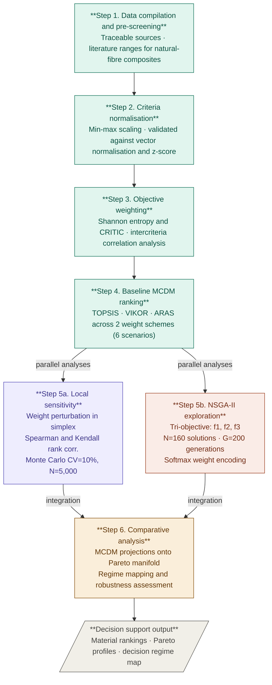

# NSGA-II and MCDM-Based Material Selection Framework

## Pipeline for Multi-Objective Optimization and Multi-Criteria Decision-Making

This repository provides the full computational pipeline supporting the research paper  
**"Decision-support analytics for material selection for production tooling: a systematic review and multi-objective optimisation of biocomposites"**.  
It implements a transparent and reproducible framework combining **NSGA-II multi-objective optimization** with **multi-criteria decision-making (MCDM) methods** for sustainable material selection in production tooling applications.

All datasets, scripts, and figures required to reproduce the results presented in the paper are provided.

---

## Table of Contents

- [Context](#context)
- [Objectives](#objectives)
- [Methodological Pipeline](#methodological-pipeline)
- [Installation](#installation)
- [Usage](#usage)
- [Repository Structure](#repository-structure)
- [Data Description](#data-description)
- [Material Datasheets](#material-datasheets)
- [References](#references)

---

## Context

Material selection for engineering applications is a multi-objective and multi-criteria problem involving trade-offs between performance, robustness, cost, and environmental impact. In industrial tooling contexts such as drilling templates and jigs, dimensional stability, stiffness retention, and hygrothermal robustness add further constraints that conventional single-criterion approaches cannot capture.

In this work:
- NSGA-II explores the full Pareto-optimal space of weighting strategies across three conflicting objectives.
- Classical MCDM methods (TOPSIS, VIKOR, ARAS) with objective weighting (Entropy, CRITIC) provide reproducible baseline rankings.
- The framework operates at the **pre-experimental stage**: it enables structured, quantitative screening of candidate materials before physical testing, concentrating the experimental programme on the most promising alternatives and reducing trial-and-error cycles.

---

## Objectives

1. Provide a reproducible NSGA-II optimisation pipeline with fixed random seed.
2. Compare NSGA-II Pareto solutions with MCDM-based rankings across multiple weighting schemes.
3. Ensure open and transparent access to all data, weights, scores, and implementation code.
4. Enable verification, reuse, and extension of the proposed methodology.

---

## Methodological Pipeline

The pipeline comprises **six reproducible steps**. Steps 1 to 4 run sequentially. Step 5 branches into two parallel analyses that converge at Step 6.



### Step 1 — Data compilation and pre-screening
A raw decision matrix is assembled for **7 candidate materials** evaluated across **9 heterogeneous criteria** covering environmental, mechanical, physico-chemical, and economic domains. Data sources are documented with traceable references; literature ranges are reported for natural-fibre composites to contextualise point estimates within known experimental envelopes.

**Materials:** Flax/Ep · Hemp/Ep · Jute/Ep · Carbon/Ep · Glass/Ep · Aluminium alloy · Chromium tool steel

**Criteria:** EF single score · density · tensile modulus · tensile strength · elongation at break · flexural modulus · flexural strength · CTE · raw material cost

### Step 2 — Criteria normalisation
Raw values are mapped to a common [0, 1] scale using a monotone min-max transformation. The procedure is validated against vector normalisation and z-score standardisation; all three schemes yield identical ordinal rankings (Spearman rho = 1.000, p < 0.001).

### Step 3 — Objective weighting

| Method | Principle |
|--------|-----------|
| **Shannon entropy** | Captures discriminative dispersion across alternatives |
| **CRITIC** | Penalises redundancy among correlated criteria; amplifies orthogonal information |

Both are applied without subjective elicitation. CRITIC amplifies the CTE weight by a factor of 7.6 relative to entropy, reflecting its low correlation with the mechanical block.

### Step 4 — Baseline MCDM ranking

| Method | Aggregation logic |
|--------|------------------|
| **TOPSIS** | Distance to ideal and anti-ideal solution |
| **VIKOR** | Compromise programming, group utility and individual regret |
| **ARAS** | Additive ratio assessment relative to an idealised reference |

Each method is applied under both weight schemes, producing 6 classical ranking scenarios used as benchmarks.

### Step 5a — Local sensitivity analysis
- **Weight perturbation:** each baseline vector is perturbed within the weight simplex; rank stability is quantified via Spearman rho and Kendall tau.
- **Monte Carlo criteria uncertainty:** N = 5,000 runs at CV = 10% multiplicative noise propagated through the full TOPSIS pipeline.

### Step 5b — Global weight-space exploration via NSGA-II
Three conflicting objectives are optimised simultaneously:

| Objective | Definition |
|-----------|-----------|
| f1 | Maximal achievable material performance score |
| f2 | Worst-case robustness (minimum material score) |
| f3 | Weight balance (negative deviation from uniform weights) |

**Settings:** population N = 160 · generations G = 200 · softmax encoding · Gaussian mutation sigma = 0.1 · seed = 9

The Pareto front contains 160 non-dominated configurations spanning performance-maximising, compromise, and robustness-oriented decision regimes.

### Step 6 — Comparative analysis
Classical MCDM weight vectors are projected onto the NSGA-II Pareto manifold, producing a topological map of which decision regimes each method implicitly occupies and which it structurally cannot access. Three representative solutions (knee, balanced, robust) are extracted and compared directly to TOPSIS, VIKOR, and ARAS outputs.

---

## Installation

Clone the repository:

```bash
git clone https://github.com/your-username/your-repository-name.git
cd your-repository-name
```

Install dependencies:

```bash
pip install numpy pandas matplotlib seaborn
```

### Requirements

| Category | Library |
|----------|---------|
| Language | Python >= 3.8 |
| Scientific | numpy · pandas · matplotlib · seaborn |
| Optimisation | NSGA-II (custom implementation) |
| Decision methods | Entropy · CRITIC · TOPSIS · VIKOR · ARAS |

---

## Usage

To replicate the NSGA-II run with the fixed seed used in the paper:

```python
from engine import run_nsga2
results = run_nsga2(seed=9, pop_size=160, n_gen=200)
```

Manual weights and alternative scenarios can be explored by modifying the Excel workbook and exporting updated tables as CSV files for use with the Python scripts.

---

## Repository Structure

```
.
├── build_database.py          # SQLite schema — 7 materials, 9 criteria
├── data_layer.py              # Database access and screening utilities
├── engine.py                  # MCDM methods and NSGA-II (stateless)
├── api.py                     # Orchestrator
├── add_data.py                # CLI utility for data entry
├── test_reproductibility.py   # Reproducibility test suite (47/47 pass)
├── materials.db               # SQLite database
├── MCDM_criteria_9.xlsx       # Full decision matrix and ranking workbook
└── data/                      # Producer datasheets (PDF)
```

---

## Data Description

The Excel workbook consolidates environmental, mechanical, physical, and economic indicators, as well as weighting schemes and ranking results, to ensure transparency and traceability of the decision process.

### Sheet: `MCDM_criteria_9.xlsx`
Core decision matrix used for all MCDM analyses.

| Criterion | Unit | Type |
|-----------|------|------|
| Environmental impact (EF single score) | µPt | Cost |
| Density | g/cm³ | Cost |
| Tensile modulus | GPa | Benefit |
| Tensile strength | MPa | Benefit |
| Elongation at break | % | Benefit |
| Flexural modulus | GPa | Benefit |
| Flexural strength | MPa | Benefit |
| Coefficient of thermal expansion (CTE) | µm/m·°C | Cost |
| Raw material cost | €/kg | Cost |

Environmental impact values are derived from LCA calculations performed using [openLCA](https://www.openlca.org) with the [Ecoinvent 3.10 database](https://ecoinvent.org). Mechanical, physical, and cost data correspond to representative values from the literature and industrial datasheets.

### Sheet: `LCA Criteria`
Environmental assessment underlying the EF single-score indicator: midpoint contributions across 16 EF 3.1 impact categories, aggregated scores, and system boundary assumptions.

### Sheet: `Ranking & analysis`
Rankings produced under entropy weights, CRITIC weights, randomised schemes, and manually defined weights. Supports comparative analysis of decision outcomes across weighting assumptions.

### Sheet: `raw ranking`
Unprocessed ranking outputs directly from MCDM scoring, before aggregation or interpretation.

### Sheet: `raw properties`
Original material property values prior to normalisation, sourced consistently for traceability.

---

## Weighting Schemes

| Scheme | Description |
|--------|-------------|
| **Entropy** | Objective weights from data dispersion |
| **CRITIC** | Objective weights accounting for contrast intensity and intercriteria correlation |
| **Randomised** | Exploratory weights for ranking sensitivity testing |
| **Manual** | User-defined weights for interactive scenario analysis |

The sum of weights is controlled to equal 1 across all analyses. The weighting method can be selected via a toggle cell on the first sheet of the workbook.

---

## Material Datasheets

Producer datasheets used to source mechanical and physico-chemical property values are archived in the `data/` folder.

| Material | Full reference | File |
|---|---|---|
| Flax/Epoxy (UD) | Eco-Technilin SAS. *FLAXPREG T-UD 110 — Technical Data Sheet*. Valliquerville, France, 2023. | [`data/FLAXPREG_110g_UD_Pre-Preg_Flax_TDS.pdf`](data/FLAXPREG_110g_UD_Pre-Preg_Flax_TDS.pdf) |
| Carbon/Epoxy | Hexcel Corporation. *HexPly M49 — 120°C Curing Epoxy Matrix, Product Data Sheet*. Doc. ref. FTM-175-AG16. Stamford, CT, USA, 2016. | [`data/HexPly_M49_eu_DataSheet.pdf`](data/HexPly_M49_eu_DataSheet.pdf) |
| Hemp/Ep · Jute/Ep · Glass/Ep · Al alloy · Cr steel | TotalMateria database (Key to Metals AG). Available via institutional subscription at [www.totalmateria.com](https://www.totalmateria.com). | — |

---

## References

If you use this work, please cite:

> L. Becker, R. Grangeat, S. De Barros.
> *Decision-support analytics for material selection for production tooling:
> a systematic review and multi-objective optimisation of biocomposites.*
> CESI LINEACT / eXcent France, 2025. *(to be updated upon publication)*
