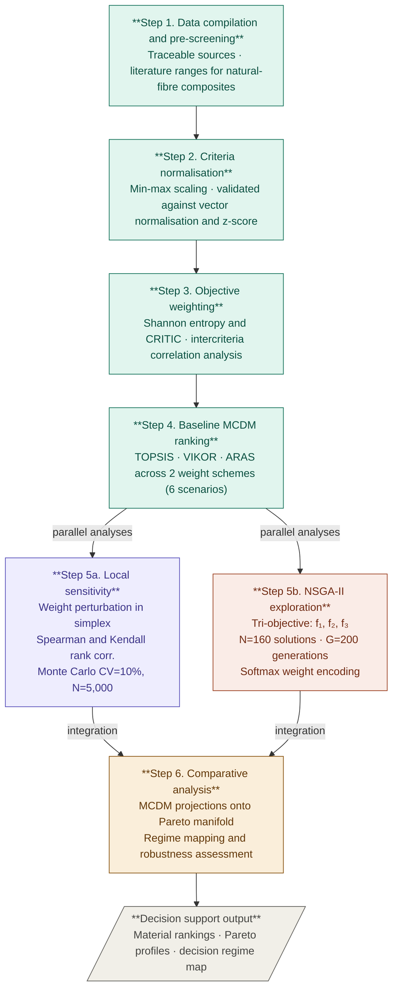

# Decision-Support Analytics for Biocomposite Material Selection

> Systematic review and multi-objective optimisation framework for sustainable
> material selection in production tooling applications.

---

## Methodological Workflow

The pipeline comprises **six reproducible steps**. Steps 1–4 run sequentially;
Step 5 branches into two parallel analyses that converge at Step 6.



---

## Step-by-Step Description

### Step 1 — Data compilation and pre-screening
A raw decision matrix is assembled for **7 candidate materials** evaluated
across **9 heterogeneous criteria** covering environmental, mechanical,
physico-chemical, and economic domains. Data sources are documented with
traceable references; literature ranges are reported for natural-fibre
composites to contextualise point estimates within known experimental
envelopes.

**Materials:** Flax/Ep · Hemp/Ep · Jute/Ep · Carbon/Ep · Glass/Ep ·
Aluminium alloy · Chromium tool steel

**Criteria:** EF single score · density · tensile modulus · tensile strength ·
elongation at break · flexural modulus · flexural strength · CTE ·
raw material cost

---

### Step 2 — Criteria normalisation
Raw values are mapped to a common [0, 1] scale using a monotone min-max
transformation that preserves relative performance while eliminating
dimensional inconsistencies. The procedure is validated against vector
normalisation and z-score standardisation; all three schemes yield identical
ordinal rankings (Spearman ρ = 1.000, p < 0.001).

---

### Step 3 — Objective weighting
Two data-driven weighting techniques are applied:

| Method | Principle |
|--------|-----------|
| **Shannon entropy** | Captures discriminative dispersion across alternatives |
| **CRITIC** | Penalises redundancy among correlated criteria; up-weights orthogonal information |

Their combined use provides complementary perspectives without requiring
subjective elicitation. CRITIC amplifies the CTE weight by a factor of 7.6
relative to entropy, reflecting its low correlation with the mechanical block.

---

### Step 4 — Baseline MCDM ranking
Three aggregation methods with distinct axiomatic structures are applied under
each weighting scheme, producing **6 classical ranking scenarios**:

| Method | Aggregation logic |
|--------|------------------|
| **TOPSIS** | Distance to ideal and anti-ideal solution |
| **VIKOR** | Compromise programming, group utility and individual regret |
| **ARAS** | Additive ratio assessment relative to an idealised reference |

---

### Step 5a — Local sensitivity analysis
Rank stability is assessed through two complementary analyses:

- **Weight perturbation:** each baseline weight vector is perturbed within the
  weight simplex; TOPSIS, VIKOR, and ARAS rankings are recomputed and
  stability is quantified via Spearman ρ and Kendall τ.
- **Monte Carlo criteria uncertainty:** N = 5,000 runs at CV = 10%
  multiplicative noise propagated through the full TOPSIS pipeline.

---

### Step 5b — Global weight-space exploration via NSGA-II
An evolutionary multi-objective optimisation is performed directly in the
weight simplex to recover the full trade-off structure of the decision problem.
Three conflicting objectives are optimised simultaneously:

| Objective | Definition |
|-----------|-----------|
| f₁ | Maximal achievable material performance score |
| f₂ | Worst-case robustness (minimum material score) |
| f₃ | Weight balance (negative deviation from uniform weights) |

**Algorithm settings:** population N = 160 · generations G = 200 ·
softmax weight encoding · Gaussian mutation σ = 0.1 · fixed seed = 9

The resulting Pareto front contains 160 non-dominated weighting
configurations spanning performance-maximising, compromise, and
robustness-oriented decision regimes.

---

### Step 6 — Comparative analysis
Classical MCDM weight vectors are projected onto the NSGA-II Pareto manifold.
This produces a topological map revealing which decision regimes each method
implicitly occupies and which regimes it structurally cannot access. Three
representative Pareto solutions (knee, balanced, robust) are extracted and
compared directly to TOPSIS, VIKOR, and ARAS outputs.

---

## Repository Structure

```
.
├── build_database.py       # SQLite schema — 7 materials, 9 criteria
├── data_layer.py           # Database access and screening utilities
├── engine.py               # MCDM methods and NSGA-II (stateless)
├── api.py                  # Orchestrator
├── add_data.py             # CLI utility for data entry
├── test_reproductibility.py # Reproducibility test suite (47/47 pass)
└── materials.db            # SQLite database
```

---

## Reproducibility

All results are fully reproducible from a fixed random seed (seed = 9).
The complete decision matrix, weight vectors, ranking scores, and
optimisation outputs are provided in the Data Availability section of the
companion manuscript.

To replicate the NSGA-II run:

```python
from engine import run_nsga2
results = run_nsga2(seed=9, pop_size=160, n_gen=200)
```

---

## Dependencies

```
python >= 3.9
numpy
scipy
pymoo        # NSGA-II
sqlite3      # standard library
```

---

## Reference

> L. Becker, R. Grangeat, S. De Barros.
> *Decision-support analytics for material selection for production tooling:
> a systematic review and multi-objective optimisation of biocomposites.*
> CESI LINEACT / eXcent France, 2025.
